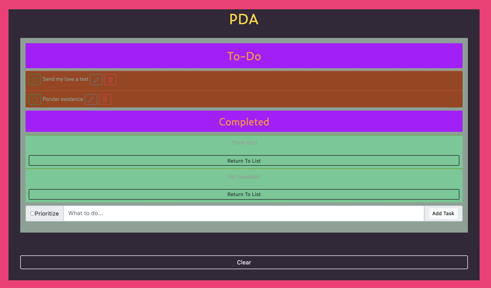
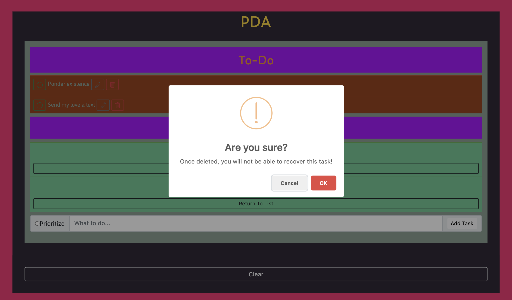

# PROJECT NAME

## Description

_Duration: 24 hours_

This is a PDA styled to do list meant to keep track of tasks you would like to complete and keep track of the tasks you have already completed. The interface has several buttons and a radio tied to different events. The prioritize radio when checked will keep tasks marked with priority above tasks that are not. The tasks will be organized in order of the time you added it and if it's a priority (the first task added with the priority settings will appear at the top, and unprioritized at the bottom). The add task button will post the task under the 'To-Do' heading. The green circle button will move the task under the 'Completed' heading. The grey pencil button allows you to edit the text and priority status of a task (you have to click add task again to add it back to the list). The red trash button will delete the task from your list. The return to list button will move a task from 'Completed' back to 'To-Do' in case of false completion or a repeating task. The clear button will clear all tasks marked completed from the interface. These buttons allows your list of tasks to be fluid and updatable while maintaining organization.

To see the fully functional site, please visit: [DEPLOYED VERSION OF APP](www.heroku.com)

## Screen Shot

### Prerequisites

Link to software that is required to install the app (e.g. node).

- [Node.js](https://nodejs.org/en/)
- [express] (https://www.npmjs.com/package/express)
- [Postgres](https://www.postgresql.org/download/)
- Postico

## Installation

1. Create a database named `weekend-to-do-app`,
2. The queries in the `weekend-to-do-app.sql` file are set up to create all the necessary tables and populate the needed data to allow the application to run correctly. The project is built on [Postgres](https://www.postgresql.org/download/), so you will need to make sure to have that installed. We recommend using Postico to run those queries as that was used to create the queries, 
3. Open up your editor of choice and run an `npm install`
4. Run `npm start` in your terminal
5. Go to localhost:5000 in the browser of your choice
6. App should be running!

## Usage
How does someone use this application? Tell a user story here.

1. Write a task decription in the text input
2. Mark task as a priority or keep it un-prioritized
3. Click the add task button to submit it
4. When the task appends to the interface there are a few ways to manage it
5. The grey pencil button will allow you to edit the description and priority status (clicking the add task button will submit your changes as a new task and the old data will be deleted)
6. The green cirle button will mark a task as complete and move it under "Completed"
7. In the "Completed" section you can click 'Return to List' to mark it uncomplete again
8. To clear all the tasks under "Completed", press the 'Clear' button at the bottom of the task interface.
9. To delete an uncompleted task, click the red trash icon button

## Built With

- Visual Code Studio
- Bootstrap
- Adobe Fonts

## Acknowledgement
Thanks to [Prime Digital Academy](www.primeacademy.io) who equipped and helped me to make this application a reality. Another thank you to my friends and family as I progress through my programming journey, and the members of my cohort for pushing me along the way

## Support
If you have suggestions or issues, please email me at [preston.thomas355@gmail.com](www.google.com)